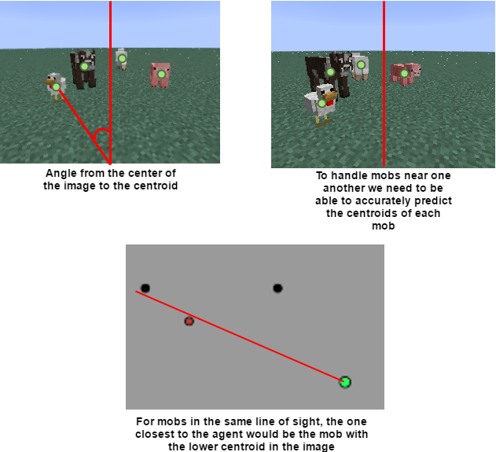

# Video
## Main Project - Mob Identifier Iterative Image Dataset
<iframe width="560" height="315" src="https://www.youtube.com/embed/Mk08YsEHYyY" frameborder="0" allowfullscreen></iframe>
### Video Description
This video is showing the progress of our main project, being able to successfully identify mobs in an image based on pixel values alone (not using Malmo). We use Malmo to generate a static superflat world and use console commands to spawn mobs at varying distances around the user. We then take screenshots, crop the mob out, resize it to 24x24, and save it to our master dataset. We have several models that are testing at the same time, each instance using its own subset of the master image dataset. These subsets have their own model trained on varying image manipulations of the dataset (e.g. grayscale, edge detection). We show/graph these image manipulations along with the number of times the model classified correctly / the total number of times the model has made a prediction. Everytime the model incorrectly classifies a mob, it adds to the models training data. You can see in the video that at the start the graph the predictions are very sparatic but as the model build its dataset it starts learning and smooths out. The video is running a slowed version so we can view the graphs live. We can speed this process up by using a static dataset of images (no more waiting for mobs to be spawned) or by increasing the speed in game.

**NOTE**: There are 3 open subplots in the bottom right of the video because we were planning on adding more features to test.

## Moonshot Project - Identifying Multiple Mobs
<iframe width="560" height="315" src="https://www.youtube.com/embed/Tm9INZ2ytA4" frameborder="0" allowfullscreen></iframe>
### Video Description
We were experimenting with ways to find and identify multiple mobs in the same image. The video describes how we segmented the image into a 3x3. We also trained a model using segments of each mob (as opposed to the whole mob). We then took a cropping with multiple mobs in it, segmented it, then predicted the probabilities of each segment being each mob. Using these 9 different prediction probabilites, we tried to logically reason where the centroids of each mob were in the image. We then draw circles in the image where we thought these mobs were.

# Project Summary

## Goals
We wanted to be able to accurately identify mobs in the world using only images. Initially, we also wanted to be able to locate mobs in the Malmo world as well but as we came to understand the complexity of this problem we were forced to simplify it. The details of our attempts will be in the **Approach** section. Our simplified goal was to take an image of a single mob in a static superflat world and accurately classify what mob it was. This was very successful and easy to do. We wanted to make the project interesting so we asked ourselves "Just how many images does our classifier need to be accurate?" Our goal became how to run experiments in Malmo to test different datasets to see which one would be the smallest, most accurate, etc.

## Dataset Creation
As we were figuring out how to approach the problem we tried **MANY** things (described in Approaches). We first needed an image dataset. We ended up spawning an agent in a world with a single mob and taking thousands screenshots. We then applied different image manipulations to these images and trained different models to test which features/models to use. We decided to use sklearns Random Forest Classifier based on these results.

We then decided that we should automate an agent to build this dataset. We spawned an agent with 4 mobs surrounding the agent at fixed locations (random distance away from the agent) and continued to turn 90 degrees to look at the mob and take screenshots. When all 4 mobs were seen we sent a Minecraft console command to kill all mobs and repeated the process. Below is an image representation:

## Iterative Model Training
As we create the above dataset we also run image manipulations on each mob we see (e.g. grayscale, edge detection). We use these image manipulations as the training features for different classifiers. These classifiers initially start with **EMPTY** subsets of the master dataset. When the model sees a label it has not seen before, it simply adds the label and its image manipulation to its feature data. If the model has seen the label before, it tries to classify that cropping. If it classifys **WRONG**, it adds the cropping to that models data. If it classifys **RIGHT**, it simply moves on. By doing this, we are performing hard negative mining. Meaning, we only add croppings to the models when we classify wrong. We only try not to add images of mobs that we know we can correctly classify.

## Image Manipulations
Here is a list of image manipulations we currently use to train:
- Plain: no manipulation
- Grayscale: convert the image to grayscale
- Edges: Perform edge detection on the image
- Reds: Only use the red values of the image
- Greens: Only use the green values of the image
- Blues: Only use the blue values of the image
- Hue: Only use the hue values of the image
- Saturation: Only use the saturation values of the image
- Value: Only use the value features of the HSV image
There were many more that we thought of but decided to show these in the video

## Moonshot Attempt - Identifying Multiple Mobs
We attempted to find a solution for identifying multiple mobs and pin-pointing where the mob is in Minecraft so we could check our accuracy.
### Identifying Multiple Mobs in a Cropping
As described in the second video above, we trained a model with segmented images and predicted their centroids.
### Checking Accuracy
With the centroids from above, we would then query the Malmo grid and try to draw vectors from the image world to the grid world. We would use the knowledge from the center of the screen and the angle for which the centroid was predicted to draw a vector in the general direction of the mob in the image and map it to the grid world. 
We can use this information to face each mob we predict if we wanted to by using the angle as the yaw of which to turn. Below is an example of us drawing a vector from a centroid.

This became a large problem when we were trying to determine what our "cone of vision" was for our agent. This was critical it determined the accuracy of the centroids and their predictions. We first thought we could do this with Malmo by using the ObservationFromRay feature but this required that we actually look at the mob with our crosshairs in game. This feature gave us information like what the mob/block that we were looking at and its location in Minecraft. We could not use this reliably because during the time it would take to look at each centroid we predicted the mobs could have moved since then.

To show our progress on this, the video above shows how we went about segmenting the image and some actual centroids we were able to predict/draw.
Due to time constraints we had to leave it at that. We did spend time researching how to get around this and experimented with different tools but we were not able to build a module that would solve this problem reliably.

## Malmo Integration
Our initial approach was to have the agent walk around and classify mobs but this proved quite the challenge because of the instance where multiple mobs are in the agents view. In addition, we included a minimap that showed the location of the mobs in relation to the agent and if they were classified or not.
We had to change the agent to be stationary with only single mobs in its view so we could automate dataset creation and model testing. We also included graphs as visuals to show how the models were learning.

# Approaches

## Dataset Creation
At first we thought that we could scrape the images from the web (e.g. Google image search, Minecraft Wiki) but quickly found that there is too much noise in the datasets we created from that. At first they seemed okay but as you venture down the search results you can see the noise.

We then decided that we could get a lot more images from playing Minecraft and gathering screenshots as we played. We decided to automate dataset creation by building an agent that would look at different mobs and crop them through a series of image manipulations.

## STOP

Every model has its tradeoffs which can be seen in the statistics. For instance, using RGB values requires feature vectors of size 24x24x3 and has

# Evaluation
# References

