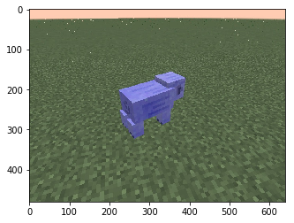

Create an AI that can accurately predict mobs in the player's field of view from gameplay screenshots. Using this information, create an AI that finds and labels mobs in a superflat world.

## Tasks:
1. Analyze image and draw a box around all mobs
2. Classify each mob from these boxes
3. Map this box center in the 2D image to a mob in the superflat world
4. Label the mob in the superflat world with its predicted label

## Technologies Used
1. OpenCV
  * image manipulation
  * haar cascades
2. Tensorflow
  * convolutional neural networks
3. Scikit-Learn
  * several out-of-the-box ML models (KNN, RandomForests, etc.)
  * data splits/testing
4. Project Malmo
  * API to interact with the Minecraft world

## Malmo Environment
* Superflat world
* Available mobs [chicken, cow, pig, sheep, mushroom cow]
* At most one of each mob spawned
* All mobs are viewable when the world is generated
* All mobs are spawned with space between them
* A Minimap that shows our AI (green circle) in the center and any nearby mobs. Mobs that have not been identified show as black circle. Once identified, mobs will show as these colors:
  * Chicken -> Yellow
  * Cow -> Brown
  * Mooshroom Cow -> Red
  * Pig -> Pink
  * Sheep -> Blue

## Auto-cropper Tool

Process to take images of single mobs and crop out just the mob
1. Original Image
2. Remove background [original img with blk background]
3. Remove noise [removal of specs]
4. Edge detection [show edges]
5. Merge contours and crop original image

<ul>
  <li>
    <a href="media/pig_original.png"><br>Original</a>
  </li>
  <li>
    <a href="media/pig_no_bg.png"><br>Background Removal</a>
  </li>
  <li>
    <a href="media/pig_no_noise.png"><br>Noise removal</a>
  </li>
  <li>
    <a href="media/pig_edges.png"><br>Edges</a>
  </li>
  <li>
    <a href="media/pig_cropping.png"><br>Final crop</a>
  </li>
</ul>

## Dataset Creation

Our process for obtaining an image dataset of 1000 images for each mob
1. Spawn superflat world with a single mob
2. Hold a photoshoot of the mob (screenshots of different angles and distances)
3. Crop mob, apply image manipulations, and save each image

We saved each cropping with the following variations
* dimensions
* aspect fit vs image stretching
* color vs edges

Examples of dataset
<ul>
  <li>
    <a href="media/cow_original.jpg"><br>Original</a>
  </li>
  <li>
    <a href="media/cow_cropped.jpg"><br>Box Resized</a>
  </li>
  <li>
    <a href="media/cow_aspect.jpg"><br>Aspect Resize</a>
  </li>
  <li>
    <a href="media/cow_edges.jpg"><br>Edges</a>
  </li>
</ul>

Dataset directory structure
```bash
chickens/
chickens/originals
chickens/cropped
chickens/cropped/color
chickens/cropped/color/24x24
chickens/cropped/color/30x30
chickens/cropped/edges
chickens/cropped/edges/24x24
chickens/cropped/edges/30x30
...
cows/
mushroom_cows/
pigs/
sheep/
```

<iframe width="560" height="315" src="https://www.youtube.com/embed/zgWinAMEOzg" frameborder="0" allowfullscreen></iframe>