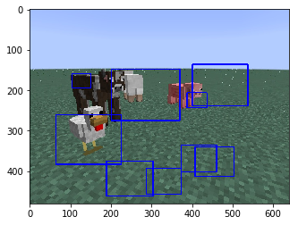
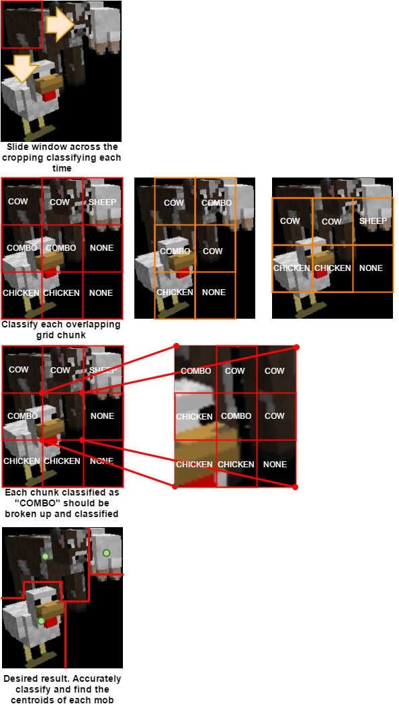
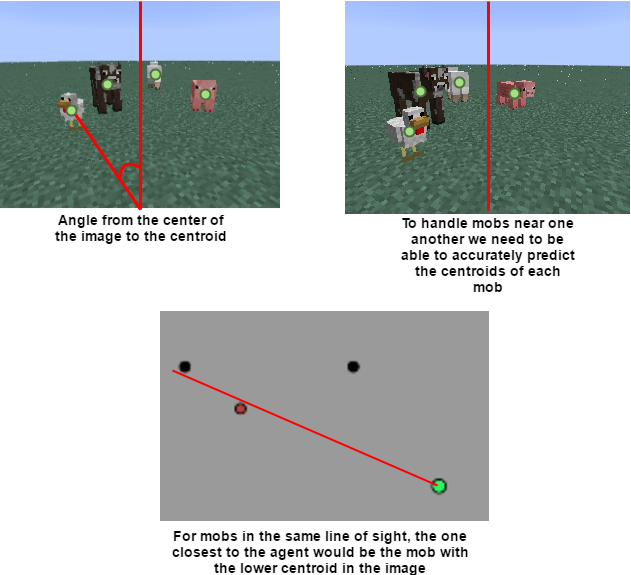

# Attempting to Solve Task 1
- Analyze image and draw a box around all mobs

## OpenCV Haar Cascades

Object Detection using Haar feature-based cascade classifiers is a machine learning based approach where a cascade function is trained from a lot of *positive* and *negative* images. It is then used to detect objects in other images. It will search the image for your trained object and draw a box around it if/when it thinks it seen it. Positive images are croppings of the image you want to detect. Negative images are of everything EXCEPT the object you want to detect. Both sets are grayscale.

We used our mob croppings as our positives and ~2000 images of an empty superflat world as our negatives. OpenCV then creates $x$ amount of image samples by superimposing the positive images onto the negative images with tunable variations (roations, pixel manipulations, etc).

We trained ~50 classifiers to try and detect single mobs (e.g. pigs) and mobs in general in the image. Each classifier's training time greatly depends on the parameters you set for the training. For us, it ranged from 5 minutes to 3+ days. The more samples you train with the longer it takes. We were expecting the high performance in the Minecraft world but each model we tried ended up with too many false positives. To combat this we did "hard negative mining" which was taking all the false positives the model predicted (images of the background) and using them as negative images when we retrained the model. For single mobs this produces about 70% accuracy of producing "good" bounding boxes. For multiple mobs the accuracy was very poor.

<a href="media/haar_cascade_example.png"></a>

Types of training variations we employed
1. positive image dimensions [24x24, 30x30, 40x40, 50x50]
2. negative image dimensions [24x24, 40x30, 60x46, 80x60]
3. number of positive images [50, 100, 200, 400, 800, 1000, 2000]
3. number of negative images [50, 100, 200, 400, 800, 1000, 2000]
4. number of hard negatives [50, 100, 200, 400]
5. single mob positives
6. all mob positives
7. feature type [haar, lbp]
8. positive images with background removed
9. positive images with aspect ratio maintained

Sample command we used to train
```bash
opencv_traincascade -numStages 20 -minHitRate 0.999 -maxFalseAlarmRate 0.5 -w 40 -h 30 -data classifiers/40x30_30/all-mobs-10000 -vec all-mobs-10000.vec -bg all-negs.txt -numNeg 1800 -numPos 9000
```
## Atempting Task 1 Conclusion

Unfortunately the time it took for us to try and increase performance with this approach was very costly. It took a lot of research/tinkering and have decided to go with another method of drawing these bounding boxes. We chalked up our losses and skipped to solving task 2.

# Solving Task 2
- Classify each mob from these boxes

## Image Classification VS Object Detection
Image classification takes a whole image and tries to say what is in the image. Object detection will search the image to find an object(s). We researched and implemented image classification methods to compare them against our object detection solutions.

## Image Classification

### Dataset
The whole screenshot of each mob in their respective directories.
```bash
pigs/
pigs/pig0001.jpg
pigs/pig0002.jpg
...
cows/
chickens/
sheep/
mushroom-cows/
```

### Tensorflow's Inception Model
We retrained tensorflow's inception data model to instead recognize minecraft mobs. We used our image dataset to train this model and it had ~99% accuracy but it was too slow for our real time solution. It took ~ 0.1 seconds to classify an image. This would limit the fps of the game to be less than 10 because we would only be able to classify at most 10 times a second. We recognized tensorflow's inception model was meant to be robust enough to handle images with extreme amounts of detail. Since our images aren't that detailed, we decided to try and write our own convolutional neural network to classify images.

### Custom Convolutional Neural Network
We developed a CNN that found the softmax probability of each mob (pig, cow, etc.) being in the view. This classifier worked well with single mobs but performed poorly with multiple mobs in the agent's view. We then decided to create separate classifiers for each of the $n$ types of mobs. For example, we created a classifier to determine if a pig was in the view (is_pig, not_pig). This required us to run $n$ of these classifiers every time we wanted to analyze an image. This method had high accuracy and speed (individually) but it seemed too inefficient to have to run $n$ classifiers every time.

## Object Detection

### Cropped Mobs Dataset
We took the original screenshots and cropped out just the mob (removing most of the world's sky and grass).
```bash
cropped-pigs/
cropped-pigs/pig0001.jpg
cropped-pigs/pig0002.jpg
...
cropped-cows/
cropped-chickens/
cropped-sheep/
cropped-mushroom-cows/
```

### Dataset Split
When then took the cropped mobs dataset and split them into 75% training images and 25% testing images.

### All Color Dataset
We created training data taking the cropped mobs and resized them to different dimensions (30x30, 40x40, etc.). We then flattened them into 1D feature vectors (from [[r,g,b], [r,g,b], ...] to [r1,g1,b1,r2,g2,b2, ...]). This creates a feature vector of length dim-width x dim-height x 3. We created this dataset with the goal of being able to train models to associate color patterns with each mob.

### HSV Color Histogram Dataset
This dataset used the same images as the dataset above but instead created a histogram of the HSV color space in the image. We converted all of the pixels to HSV (hue saturation value) because it is easier to store vs RGB. These feature vectors are of length 8 x 8 x 8 = 512$. This dataset has the advantage of saving space over the previous dataset because the vector length is only 512.

### Edge Dataset
We created training data taking the cropped mobs and performed edge detection on them. These images are black and white and the edges are represented with white pixels. This created black and white feature vectors of length dim-width x dim-height ([1,0,0,0,1,1,1, ...]). We created this dataset with the goal of being able to train models to associate edge patterns with each mob.

### KNN
Sklearn's out-of-the-box KNN classifier performed ~99% accuracy for all dimensions of cropped mobs in the color and edge datasets.

### Random Forests
Sklearn's out-of-the-box random forest classifier was able to achieve 100% accuracy on color datasets.

## Task 2 Conclusion
Tensorflow's inception model was accurate but wasn't fast enough for us. We tried building our own CNN image classifier but it struggled with handling multiple mobs and became inefficient. Also, image classification was able to tell us **IF** a mob was in a screenshot image but not also **WHERE**. This is why we needed to use *object detection*.

For our object detection models we used mob croppings as our datasets vs whole images. This is because for object detection algorithms, they analyze clips of an image and not the whole image. We decided to use an ensemble of sklearn's Random Forest for color detection and KNN for edge detection. This ensemble was able to classify an image cropping in ~0.000553 seconds. This gave use the speed and accuracy we needed to classify a **CROPPING**.

Being able to successfully classify croppings solves task 2, "classify each mob from these boxes".

Now that we can do that, we had to then think of ways to pull mobs individually from the image and draw the boxes to begin with. Then we would be able to detect each on accurately. This was *WAY EASIER SAID THAN DONE*.

# Re-attempting Task 1
- Analyze image and draw a box around all mobs

**Note:** We are in the process implementing this algorithm.

We are able to successfully classify a cropping of an image based on colors and edges. However, if a mob is in front of another mob the edge detection becomes a harder problem since those edges are lost. So we are sticking with color detection for now until we can solve this. For the purposed algorithms below, we'd also like to add the ability to classify a "combo". This class is the instance where there are more than one mob in the image.
1. Remove noise from image by cropping out everything that isn't the background
2. Separate the entities that aren't touching
3. Analyze each entity to determine if multiple mobs exist in them.

Ways to analyze each entity:
- Naive sliding window: loop over entity and slide a window 1 pixel at a time. Classify color each time and try to box in each mob. Perform a final check over your purposed boxes to match color *and* edges.
- Grid: Cut the entity up into chunks (3x3). Convert each chunk into feature vectors and classify them. If a combo is predicted, consider splitting/resizing the chunk and classifying the halves. Analyze the results and make predictions (voting system, etc.)
- Overlapping Grid: Use the same concept as the grid but include overlapping sections to increase confidence.

<a href="media/MobDetector.png"></a>

After being able to find all mobs and classify them, find the center of their rectangle and pass it to task 3.

## Re-attempting Task 1 Conclusion
In theory we believe this will give us accurate results in splitting up multiple mobs and finding their center points.

# Task 3 and 4
- Map this box center in the 2D image to a mob in the superflat world.
- Label the mob in the superflat world with its predicted label

## Geometry
The screenshots of the image guarantee that the center of the image is where the agent is looking. If the resolution of the image is 640x480, then the center of the image would be 320x240. You can then calculate the angle from the center of the image to the bottom of the screen and to the centroid of the mob. This will give the angle that your agent would have to turn to face the classified mob.

<a href="media/Detector-Line-Of-Sight.png"></a>

You can query the world for the mobs around you and predict which mob in your line of sight is what class.

## Malmo Integration
Once a specific mob has been identified as viewable on the screen, the following steps will occur:
* X and Z coordinates will be calculated for the specified mob
* Our current AI will turn and walk towards the mob
* Once our AI is right next to the mob (within a specified distance), the mob will then be classified and the color of the mob on the minimap will be changed
* Our AI will then turn and repeat the procress to then classify the next mob
* Once all mobs are classified, our AI will stop moving

## Video of our Project in Malmo
Currently, we have not bridged the connection between the image classification and Malmo. For testing and in the video below, rather than taking the input of the X and Z values of a specific mob from the image, X and Z coordinates are being taken as input from the Malmo environment and our AI moves towards and classifies the closest mob.

<video controls src="media/demo.mov" width="800" height="600"></video>

# Planned Additions
* Counter for how many mobs have been classified
* Legend for minimap that shows which mob is which color
* Graph corresponding to how long it takes to classify all total mobs
* Graph corresponding to how many mobs are correctly classified

# Planned Changes
* Our AI will not move and classify the mobs from afar
* Classification and updating of the minimap will be changed based off of verifying if the calculated mob is correct in Malmo
* Once all potential mobs are either classified or not, a new mission will be generated with the mobs spawned randomly (number of missions: TBD)
